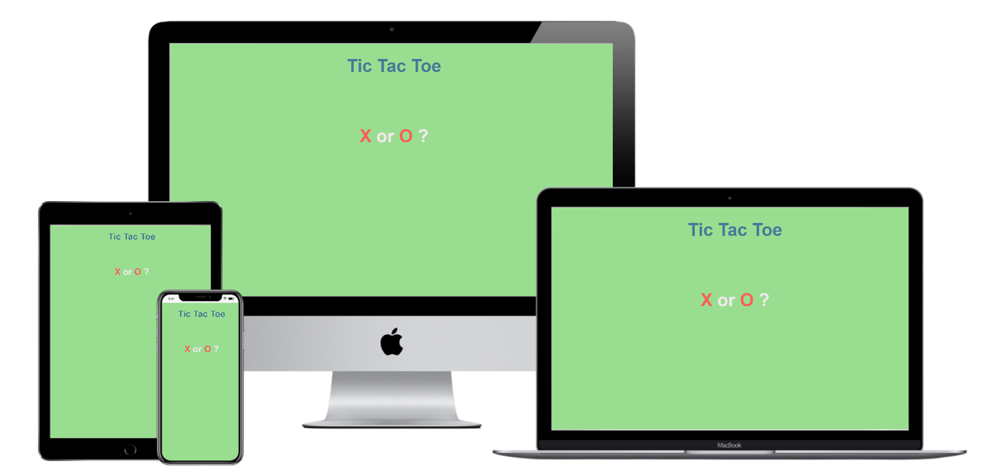

# JavaScript Tic Tac Toe Game

The live website can be found [here](https://kaytee123.github.io/tic-tac-toe-javascript-ms2/)

## Purpose

This Website was created for the sole purpose of completing the second Milestone Project for the Code Institute's Full Stack Developer course. It was built using the knowledge gained from the HTML, CSS, User Centric Design, JavaScript Fundamentals and Interactive Frontend Development modules. A full list of technologies used can be found in the [technologies](#Technologies-Used) section of this document.

## User Experience Design
### **The Strategy Plane**
This website was created to showcase my knowledge of HTML, CSS & JavaScript and to provide users with some entertainment in the form of an online Hangman game created with JavaScript and SVG and jQuery. The game should be easy to understand, simple to interactive with and give feedback to the user on all inputs.

Site Goals:
* To showcase the skills I have learnt in HTML, CSS, JavaScript.
* To provide users with an interactive game to play that has clear Win / Lose Scenarios.
* To create an enjoyable, interactive game that makes the user want to stay and play again.
* To create a game that makes the user want to return to the website.
* To help reduce boredom in this hard times.

#### User stories
* As a user, I want to easily understand the main purpose of the site.
* As a user, I want to view the website and content clearly on any device.
* As a user, I want to have instructions on how to play the game so that I can easily understand the rules.
* As a user, I want to be able to start a game when I am ready.
* As a user, I want to see whether I won or lost against an AI.
* As a user, I want to know whether my guess was successful or not.
* As a user, I want a way to start a new game when the current game has ended.
* As a user, I want to know whether I can change the grid selected.
* As a user, I want to know if I can select the level of difficulties.
* As a user, I want to see other work the site owner has created.

### **The Scope Plane**
Features planned:
* Ability to choose an X or O.
* An interactive Tic Tac Toe.
* Giving the user abililty to start first.
* Ability to play with an AI.
* Start Button.
* information to play on another grid when a grid has already been selected.
* Restart Game button.
* Win / Lose information.

### **The Structure Plane**

User Story:
> As a user, I want to easily understand the main purpose of the site.
 
 Acceptance Criteria:
* Header displayed with text 'TIC TAC TOE' which is centered
* Sub heading displayed with text 'X or O?'

Description: 
This game gives the user the abilty to select X or O giving the AI the other unchoosen letter to play with the user. After the user chooses 
a letter to play with, a 9 grid board game is then started.

User Story:
> As a user, I want to view the website and content clearly on any device.
 
 Acceptance Criteria:
 * Website layout is well displayed and readable across all sized devices.

Description: 
Bootstrap will be used to lay the content of the Website out in containers, rows and columns. Mobile first design will be used when coding the project and testing will be required to ensure the layout is clear on all devices. No elements should overlap their containers and all items should be responsive so that no elements are too large to display properly.

****
## Technologies
* [HTML](https://en.wikipedia.org/wiki/HTML)
	* This project uses HTML as the main language used to complete the structure of the Website.
* [CSS](https://en.wikipedia.org/wiki/CSS)
	* This project uses custom written CSS to style the Website.
* [JavaScript](https://en.wikipedia.org/wiki/JavaScript)
	* This project uses JavaScript for functionality through the Website, this includes the puzzle game, onclick button functions, use of the Email API and Google Maps APIs.
* [jQuery](https://jquery.com/)
    * jQuery was used throughout the hangman.js file to minipulate css and html properties.
* [Bootstrap](https://getbootstrap.com/)
	* The Bootstrap framework is used throughout this website for layouts and styling. 
* [Google Fonts](https://fonts.google.com/)
	* Google fonts are used throughout the project to import the *Playfair Display SC* and *Rokkitt* fonts.
* [Visual Studio Code](https://code.visualstudio.com/)
	* VS Code is the Integrated Development Environment used to develop the Website.
* [GitHub](https://github.com/)
	* GithHub is the hosting site used to store the source code for the Website and [Git Pages](https://pages.github.com/) is used for the deployment of the live site.
* [Git](https://git-scm.com/)
	* Git is used as version control software to commit and push code to the GitHub repository where the source code is stored.
 * [TinyJPG](https://tinyjpg.com/)
	* TinyJPG is used to reduce the file sizes of images before being deployed to reduce storage and bandwidth.   
* [Google Chrome Developer Tools](https://developers.google.com/web/tools/chrome-devtools)
	* Google chromes built in developer tools are used to inspect page elements and help debug issues with the site layout and test different CSS styles.
* [balsamiq Wireframes](https://balsamiq.com/wireframes/)
	* This was used to create wireframes for 'The Skeleton Plane' stage of UX design.
* [CSS Generator](https://cssgenerator.org/rgba-and-hex-color-generator.html)
    * This was used to convert the RGBA colour for the site to Hex. 
* [Favicon](https://favicon.io/)
    * Favicon.io was used to make the site favicon 
* [Techsini](http://techsini.com/multi-mockup/index.php)
    * tecnisih.com Multi Device Website Mockup Generator was used to create the Mock up image in this README.
* [Live Server](http://github.com/)
    *This was used to help see how my codes appeared on my google chrome while coding.

## Testing

### Test Strategy
#### **Summary**

Testing is required on The Tic Tac Toe JavaScript game created for Milestone Project 2. All features and user stories documented in the README are to be tested. 

HTML code must pass through the [W3C HTML Validator](https://validator.w3.org/).

CSS code must pass through the [W3C CSS Validator](https://jigsaw.w3.org/css-validator/).

JavaScript code must pass through the [JSHint Validator](https://jshint.com/).

GitHub Respoitory must be set to public for the live website to be displayed.

#### **Regression Testing**

All features previously tested while in development should be retested on the live Website.

#### **Assumptions and Dependencies**

Testing is dependent on website being live on GitHub pages.

### Project Creation
To create this project I initialised the repository by typing the following command into the bash terminal in Visual studio code:
* git init

For the initial commit I clicked on the Source Control menu on the side bar in Visual Studio code. Added the change to the staging area by clicking the '+' icon next to the file name. I then added a commit message in the text box below source control. Lastly I clicked on the Public to GitHub icon in the bottom left hand side of Visual Studio Code and I was then prompted with the following two options:
    
    * Publish to GitHub private repository
    * Public to GitHub public repository

I selected publish to GitHub public repository and my first commit was published.

The following commands were used for version control throughout the project:
* git add filename - This command was used to add files to the staging area before committing.
* git commit -m "commit message explaining the updates" - This command was used to to commit changes to the local repository.
* git push - This command is used to push all committed changes to the GitHub repository.

### Using Github Pages
1. Navigate to the GitHub [Repository:](https://kaytee123.github.io/tic-tac-toe-javascript-ms2/)
1. Click the 'Settings' Tab.
1. Scroll Down to the Git Hub Pages Heading.
1. Select 'Master Branch' as the source.
1. Click the Save button.
1. Click on the link to go to the live deployed page.

### Run Locally
1. Navigate to the GitHub [Repository:](https://kaytee123.github.io/tic-tac-toe-javascript-ms2/)
1. Click the Code drop down menu.
1. Either Download the ZIP file, unpackage locally and open with IDE (This route ends here) OR Copy Git URL from the HTTPS dialogue box.
1. Open your developement editor of choice and open a terminal window in a directory of your choice.
1. Use the 'git clone' command in terminal followed by the copied git URL.
1. A clone of the project will be created locally on your machine.

****
## Credits

### Code
The JavaScript Tic Tac Toe game was created by following a tutorial on [Youtube](https://www.youtube.com/watch?v=Y-GkMjUZsmM&t=526s).

### Acknowledgements
* Code Institute
* Crash course on EDX
* Youtube
* My mentor Femi
* Codeacademy